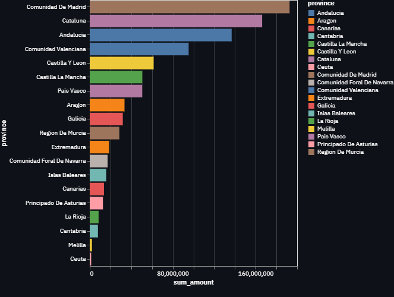
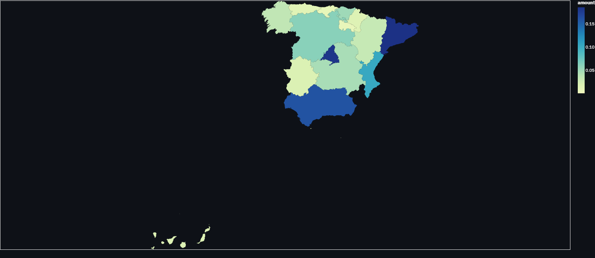
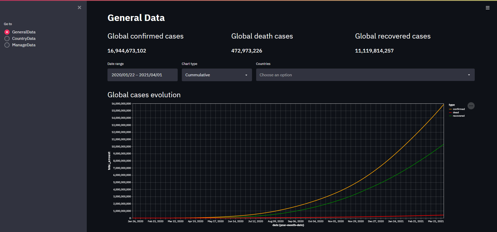
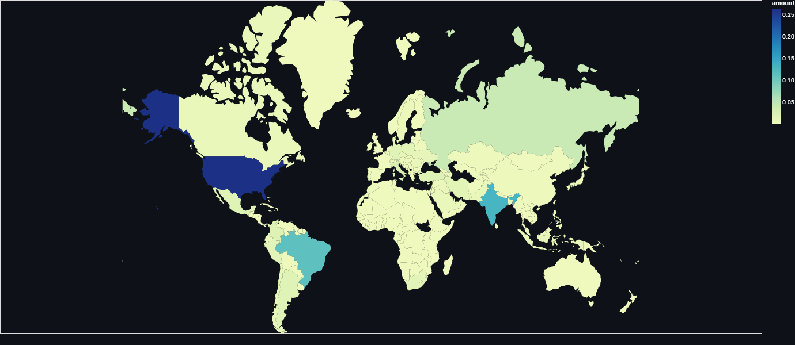

# COVID dashboard

[](https://frontend-alesanmed.cloud.okteto.net/)

Este proyecto contiene el cuadro de mandos. Hecho con [Streamlit](https://streamlit.io/).

# Table of contents

- [Algunas capturas 📸](#screenshots)
- [Ejecución del código 🚂](#running-code)
  - [Instalación 🎢](#installing)
  - [Configuración ⚙](#configuring)
  - [Ejecución 🎯](#running)
- [Páginas](#pages)
  - [General data](#general-data)
  - [Country data](#country-data)
  - [Manage data](#manage-data)

## Algunas capturas 📸 <a name="screenshots"></a>








## Ejecución del código 🚂 <a name="running-code"></a>

Para poder ejecutar el backend desde el código fuente es necesario, lo primero, clonar el código e instalar las dependencias.

```
git clone https://github.com/alesanmed-educational-projects/core-data-covid-project.git

cd core-data-covid-project/dashboard
```

### Instalación 🎢 <a name="installing"></a>

Primero hay que instalar las dependencias con:

```
pip install -r requirements.txt
```

O, si usas [Poetry](https://python-poetry.org/):

```
poetry install
```

### Configuración ⚙ <a name="configuring"></a>

El proyecto se vale de las siguientes variables de entorno para su configuración:

- BACK_URL: URL de la API de flask

### Ejecución 🎯 <a name="running"></a>

Una vez las dependencias están instaladas, puedes ejecutar el servidor de Streamlit con:

```
streamlit run app/main.py
```

## Páginas <a name="pages"></a>

### General data <a name="general-data"></a>

Contiene datos generales del coronavirus. Casos globales, gráficas globlales y por países y un mapa.

Se pueden filtrar los datos por países y por tipos, además de elegir el tipo de gráfica.

### Country data <a name="country-data"></a>

Contiene datos detallados por país. Se desglosan por provincias y se puede exportar a PDF y mandar ese PDF por email.

De nuevo, se puede filtrar por provincias, tipo de caso y tipo de gráfica.

### Manage data <a name="manage-data"></a>

Permite crear países nuevos usando un API key. Los países creados deberán estar disponibles inmediatamente.
